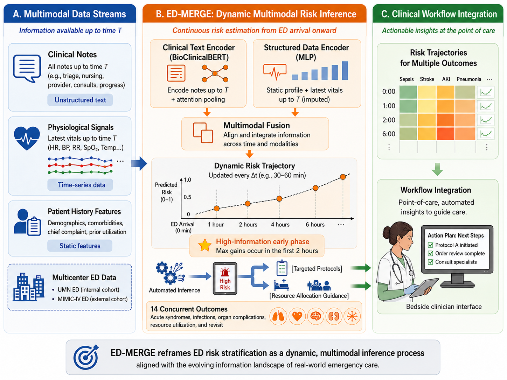

# ED-MERGE

**ED-MERGE** is a dynamic multimodal framework for early risk stratification in the Emergency Department (ED), integrating unstructured clinical notes, dynamic vital signs, and static structured patient features through a dual-encoder fusion architecture. Risk estimates are updated continuously as new information accrues during the ED visit, with strict prevention of look-ahead bias at every observation window.

This repository contains the full implementation accompanying the manuscript:

> *ED-MERGE: A Dynamic Multimodal Framework for Early Risk Stratification in the Emergency Department with External Validation*
> Xinrui Xiong, Xinnie Mai, et al. — University of Minnesota

<p align="center">
  
</p>

---

## Overview

ED-MERGE predicts 14 clinical outcomes simultaneously from data available within the first 6 hours of ED arrival. At any observation time T, the model processes all information documented before T, with the effective cutoff capped at `min(intime + T, dx_time)` to prevent diagnosis-time leakage.

**Predicted outcomes (14 total)**

| Category | Outcomes |
|---|---|
| Acute syndromes | Sepsis, ACS/MI, Stroke, AHF, AKI, ARDS, PE, COPD exacerbation, Asthma exacerbation, COPD+Asthma |
| Infectious | Pneumonia (all-cause) |
| Utilization | Hospitalization, Critical outcome, 3-day ED revisit |

*Critical outcome* is defined as in-hospital mortality or ICU transfer within 12 hours.

**Key results (internal UMN cohort, 60-min window)**
- Macro AUROC: 0.928 (95% CI, 0.927–0.929)
- Macro AUPRC: 0.382 (95% CI, 0.379–0.384)

**External validation (BIDMC / MIMIC-IV-ED, zero recalibration)**
- Macro AUROC: 0.855 (95% CI, 0.853–0.856)

---

## Repository Structure

```text
ED-MERGE/
├── create_multimodal_dataset.py     # temporal multimodal dataset construction
├── create_multimodal_dataset.sh
├── train_multimodal.py              # main multimodal model training
├── train_multimodal.sh
├── single_modal.py                  # single-modality ablation experiments
├── single_modal.sh
├── extract_stay_ids.py              # positive case sampling for interpretation
├── extract_stay_ids.sh
├── ig_text.py                       # Integrated Gradients text attribution
├── ig_text.sh
├── figures/
│   └── framework_overview.png
└── mimic_iv_validation/
    ├── non-finetune/
    │   ├── preprocess.py            # MIMIC feature alignment to UMN space
    │   ├── preprocess.sh
    │   ├── evaluation.py            # zero-recalibration external evaluation
    │   └── evaluation.sh
    └── finetune/
        ├── preprocess.py
        ├── preprocess.sh
        ├── evaluation.py            # site-adapted fine-tuning evaluation
        └── evaluation.sh
```

---

## Model Architecture

ED-MERGE uses a three-component fusion architecture:

1. **Clinical Text Encoder** — BioClinicalBERT encodes each note independently via sliding-window tokenization (512-token chunks, 128-token stride). Note-level `[CLS]` embeddings are aggregated into a single encounter representation using a trainable attention pooling layer.

2. **Tabular Encoder** — An MLP maps static structured features (age, Charlson/Elixhauser comorbidities, chief complaint indicators) and dynamic vital signs (the most recent measurement within window T) into a 128-dimensional embedding: `Linear(F,256) → BN → ReLU → Dropout(0.2) → Linear(256,128)`.

3. **Fusion Classifier** — Text and tabular embeddings are concatenated (768+128=896 dimensions) and passed through a shared hidden layer: `Linear(896,512) → BN → ReLU → Dropout(0.1) → Linear(512,14)`. Fourteen independent sigmoid outputs produce multi-label predictions.

Training uses Focal Loss (α=0.25, γ=2.0) with AdamW. Differential learning rates are applied: BERT encoder at 2e-5, all other parameters at 1e-3.

---

## Pipeline

### Step 1 — Dataset Construction

`create_multimodal_dataset.py` builds model-ready train/val/test pickle files from the internal UMN ED cohort.

The script:
- Splits encounters chronologically: ≤2022 for development, ≥2023 for testing
- Performs subject-level 90/10 train/validation split within the development pool
- Filters notes and vitals to within `effective_end = min(intime + window, dx_time)`
- Builds `final_*` vital features as the most recent within-window measurement, falling back to triage values
- Fits a `StandardScaler` on training data only; applies to val and test
- Outputs `train.pkl`, `val.pkl`, `test.pkl`, and `scaler.pkl`

```bash
python create_multimodal_dataset.py \
  --master_parquet /path/to/master_dataset.parquet \
  --notes_dir /path/to/notes_parts/ \
  --notes_stay_col SERVICE_ID \
  --notes_time_col FILING_DATE \
  --notes_text_col NOTE_TEXT \
  --vitals_file /path/to/vitals.tsv \
  --output_dir /path/to/preprocessed_1h \
  --time_window 1h \
  --train_year_le 2022 \
  --test_year_ge 2023 \
  --val_ratio 0.1 \
  --seed 42
```

Repeat with different `--time_window` values (e.g., `t0`, `30min`, `1h`, `2h`, `6h`) to generate datasets for each evaluation window.

---

### Step 2 — Multimodal Training

`train_multimodal.py` trains the full multimodal model on the preprocessed dataset.

```bash
python train_multimodal.py \
  --preprocessed_dir /path/to/preprocessed_1h \
  --bert_dir /path/to/Bio_ClinicalBERT \
  --output_dir /path/to/model_output_1h \
  --epochs 4 \
  --batch_size 8 \
  --grad_acc 4 \
  --max_notes 100 \
  --doc_stride 128 \
  --max_windows_per_sample 200
```

The best checkpoint is selected by validation macro AUPRC. Per-outcome F1-maximizing thresholds are computed from the validation set and saved alongside the checkpoint.

Outputs:
```text
best_model.pt           # model weights + outcome_cols + tabular_cols + thresholds + tokenization config
best_thresholds.json
test_metrics.json
test_text_embeddings.npy
test_tabular_embeddings.npy
test_fused_embeddings.npy
test_labels.npy
test_stay_ids.txt
```

---

### Step 3 — Single-Modality Ablations

`single_modal.py` supports modality-specific ablation experiments under the same architecture and training procedure.

| Mode | Features used |
|---|---|
| `multimodal` | Text + vitals + static structured |
| `text_only` | Text only (no tabular input) |
| `vitals_only` | Dynamic vital signs only (`final_*` columns) |
| `profile_only` | Static structured only (comorbidities + chief complaint + age) |

```bash
python single_modal.py \
  --preprocessed_dir /path/to/preprocessed_1h \
  --bert_dir /path/to/Bio_ClinicalBERT \
  --output_dir /path/to/ablation_text_only_1h \
  --mode text_only \
  --epochs 4 \
  --batch_size 8
```

---

### Step 4 — Positive Case Sampling

`extract_stay_ids.py` samples positive encounters from `test.pkl` for a given outcome. Used to select cases for interpretation.

```bash
python extract_stay_ids.py \
  --preprocessed_dir /path/to/preprocessed_1h \
  --outcome_col outcome_sepsis \
  --n 50 \
  --seed 42 \
  --out_txt pos_stay_ids.txt \
  --out_csv pos_stay_ids.csv
```

---

### Step 5 — Text Attribution

`ig_text.py` computes Integrated Gradients (IG) attribution over the text embedding space for a single encounter, using a trained multimodal checkpoint.

The tabular branch is held fixed at its zero-baseline during attribution. IG is computed over `inputs_embeds`, not token IDs, covering up to the first 512 tokens of each note (sliding window not applied during attribution).

```bash
python ig_text.py \
  --preprocessed_dir /path/to/preprocessed_1h \
  --ckpt /path/to/best_model.pt \
  --bert_dir /path/to/Bio_ClinicalBERT \
  --split test \
  --stay_id 12345678 \
  --label outcome_sepsis \
  --steps 50 \
  --baseline mask \
  --top_k 15 \
  --out_dir /path/to/ig_output
```

Outputs:
```text
sentence_ig.csv
sentence_ig_topk.png
ig_highlight_note*.html
run_summary.json
```

---

## External Validation on MIMIC-IV-ED

External validation uses the independent BIDMC cohort from MIMIC-IV-ED. The UMN-trained model is applied directly without site-specific recalibration or threshold adjustment, providing a strict assessment of cross-institutional transportability.

MIMIC-IV data is available at [PhysioNet](https://physionet.org) (requires credentialed access):
- MIMIC-IV v1.0
- MIMIC-IV-ED v1.0
- MIMIC-IV-Note v2.2

### MIMIC Preprocessing

Both validation settings share the same preprocessing step. The script aligns MIMIC features to the UMN training feature space using the UMN `train.pkl` column order and `scaler.pkl`.

```bash
python mimic_iv_validation/non-finetune/preprocess.py \
  --mimic_csv /path/to/mimic_with_notes.csv \
  --umn_scaler_path /path/to/scaler.pkl \
  --umn_train_pkl_path /path/to/train.pkl \
  --output_dir /path/to/mimic_splits \
  --prefix mimic_external \
  --seed 42 \
  --train_ratio 0.8 \
  --val_ratio 0.1 \
  --test_ratio 0.1
```

---

### Zero-Recalibration Evaluation (primary)

Evaluates the UMN-trained checkpoint on the full MIMIC cohort without updating any model parameters or thresholds. This is the setting reported in the paper.

```bash
python mimic_iv_validation/non-finetune/evaluation.py \
  --ckpt_path /path/to/best_model.pt \
  --thresholds_path /path/to/best_thresholds.json \
  --train_pkl /path/to/mimic_external_train.pkl \
  --val_pkl /path/to/mimic_external_val.pkl \
  --test_pkl /path/to/mimic_external_test.pkl \
  --umn_train_pkl_path /path/to/train.pkl \
  --bert_dir /path/to/Bio_ClinicalBERT \
  --mode multimodal \
  --batch_size 32 \
  --out_dir /path/to/non_finetune_eval
```

---

### Fine-Tuned Evaluation (exploratory)

Initializes from the UMN checkpoint and adapts the model on MIMIC training data before evaluating on held-out MIMIC test data. This is an exploratory setting not used for the paper's reported external validation results.

```bash
python mimic_iv_validation/finetune/evaluation.py \
  --ckpt_path /path/to/best_model.pt \
  --bert_dir /path/to/Bio_ClinicalBERT \
  --umn_train_pkl_path /path/to/train.pkl \
  --train_pkl /path/to/mimic_external_train.pkl \
  --val_pkl /path/to/mimic_external_val.pkl \
  --test_pkl /path/to/mimic_external_test.pkl \
  --mode multimodal \
  --do_finetune \
  --finetune_epochs 3 \
  --lr 1e-5 \
  --batch_size 16 \
  --freeze_text_encoder \
  --out_dir /path/to/mimic_finetune_eval
```

---

## Input Data Format

### Internal UMN Data

**Master parquet** (encounter level):
```
subject_id, stay_id, intime, dx_time, age,
cci_*, eci_*, chiefcom_*,
triage_temperature, triage_heartrate, triage_resprate,
triage_o2sat, triage_sbp, triage_dbp,
outcome_*
```

**Notes parquet directory** (one or more parquet files):
```
stay_id / SERVICE_ID
filing_date / FILING_DATE    (final signature timestamp)
note_text / NOTE_TEXT
```

**Vitals TSV**:
```
SERVICE_ID, DISPLAY_NAME, RECORDED_DATETIME, VALUE_ORIG
```
`DISPLAY_NAME` values: `Temp`, `Heart Rate`, `Resp`, `SpO2`, `BP (SYSTOLIC)`, `BP (DIASTOLIC)`

### MIMIC-IV-ED Data

```
stay_id
admission_note_text / note_text / NOTE_TEXT
triage_temperature, triage_heartrate, triage_resprate,
triage_o2sat, triage_sbp, triage_dbp
cci_*, eci_*
outcome_*
```

Missing UMN-aligned features are zero-filled before scaling.

---

## Data Availability

**UMN cohort**: Not publicly available due to HIPAA and institutional policy. De-identified subsets may be requested for academic replication purposes via the corresponding author, subject to IRB approval and a Data Use Agreement.

**MIMIC-IV / BIDMC cohort**: Publicly available on PhysioNet after completing CITI training and obtaining credentialed access:
- [MIMIC-IV v1.0](https://physionet.org/content/mimiciv/1.0/)
- [MIMIC-IV-ED v1.0](https://physionet.org/content/mimic-iv-ed/1.0/)
- [MIMIC-IV-Note v2.2](https://physionet.org/content/mimic-iv-note/2.2/)

---

## Environment

```text
Python 3.11
PyTorch
Transformers (HuggingFace)
scikit-learn
pandas
numpy
tqdm
captum
matplotlib
```

The scripts assume a local BioClinicalBERT checkpoint directory. The `.sh` files are configured for a Slurm cluster using Apptainer and can be submitted with `sbatch`.

---

## Reproducibility

- All random seeds are configurable via `--seed`
- Train/test split is chronological (year-based), not random
- Train/validation split is subject-level to prevent patient-level leakage
- The scaler is fit on training data only and reused for val, test, and external validation
- Each checkpoint stores `outcome_cols`, `tabular_cols`, and tokenization parameters (`max_length`, `doc_stride`, `max_notes`, `max_windows_per_sample`) to ensure consistent inference

---

## Contact

For questions about this repository, please contact xion3020@umn.edu
